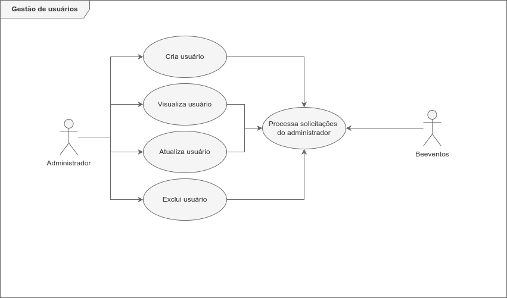
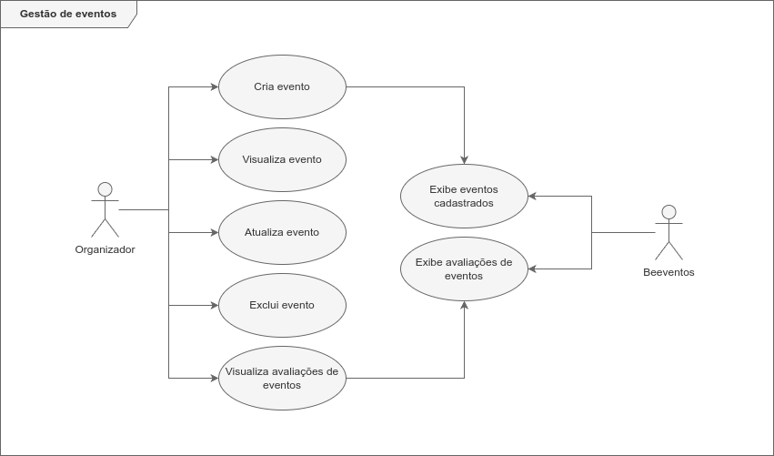
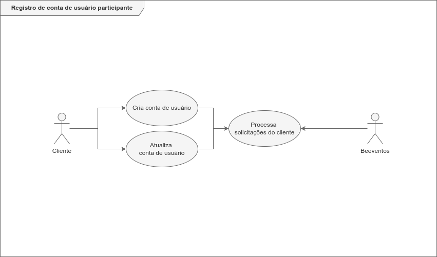
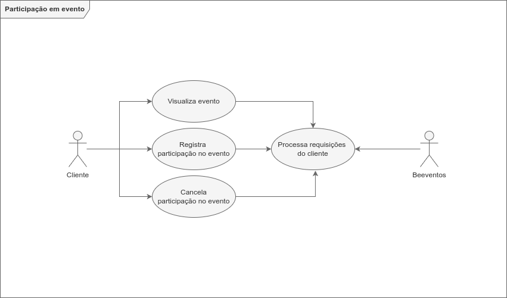
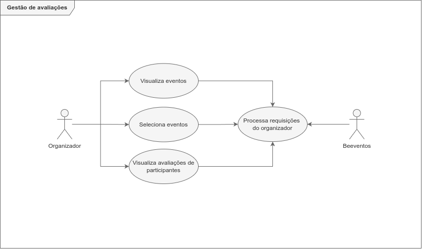

<h1 width="100vw" align="center" background-color="#1E1800">
  
</h1>

### Sobre o projeto

O BEEVENTOS é um software de apoio à gestão da qualidade de eventos. Conecta organizadores e participantes a fim de contribuir com o processo de melhoria contínua da qualidade dos eventos realizados.

### Interfaces de software

|        | Tipo                                           | Descrição                                                                        |
| ------ | ---------------------------------------------- | -------------------------------------------------------------------------------- |
| SFW001 | Banco de dados                                 | Serviço de banco de dados online                                                 |
| SFW002 | Controle de versões                            | Software para controle de versões e armazenamento de código fonte                |
| SFW003 | CI/CD (Integração contínua e Entrega Contínua) | Software para criação e distribuição de containers de aplicação e banco de dados |

### Funções do produto (Requisitos do usuário)

|       | Função               | Descrição                                                                                 |
| ----- | -------------------- | ----------------------------------------------------------------------------------------- |
| FP001 | Gestão de usuários   | Sistema de registro, autenticação e gestão de usuários                                    |
| FP002 | Gestão de eventos    | Criação, visualização, atualização e exclusão de eventos.                                 |
| FP003 | Gestão de avaliações | Criação, visualização, atualização e exclusão de avaliações quantitativas e qualitativas. |

### Restrições

|        | Função               | Descrição                                                                                                    |
| ------ | -------------------- | ------------------------------------------------------------------------------------------------------------ |
| RST001 | Legal                | O produto deve estar em conformidade com a Lei Geral de Proteção a Dados (LGPD).                             |
| RST002 | Ambiente operacional | O software pode ser executado nos sistemas operacionais: Windows, MacOS, Linux, Android, iOS                 |
| RST003 | Ambiente de execução | O software pode ser acessado através dos navegadores: Google Chrome, Mozilla Firefox, Safari, Microsoft Edge |

### Suposições e dependências

|        | Tipo                           | Descrição                                                                    |
| ------ | ------------------------------ | ---------------------------------------------------------------------------- |
| SPD001 | Disponibilidade                | O software será hospedado na internet                                        |
| SPD002 | Ferramentas de desenvolvimento | Editor de códigos VsCode, Docker, Sistema de gerenciamento de banco de dados |
| SPD003 | Fornecedores externos          | Serviço de hospedagem de banco de dados e aplicação                          |
| SPD004 | Linguagens de programação      | Javascript                                                                   |

### Requisitos funcionais

|       | Tipo                                      | Descrição                                                                                                                        |
| ----- | ----------------------------------------- | -------------------------------------------------------------------------------------------------------------------------------- |
| RF001 | Gestão de usuários                        | Permitir que organizadores criem, visualizem, atualizem e excluam contas de usuários administrativos                             |
| RF002 | Gestão de eventos                         | Permitir que organizadores, criem, visualizem, atualizem e excluam eventos                                                       |
| RF003 | Registro de conta de usuário participante | Permitir que cliente crie e edite sua conta usuário a fim de participar de eventos                                               |
| RF004 | Visualização de eventos                   | Permitir participantes visualizem os eventos cadastrados                                                                         |
| RF005 | Participar de evento                      | Permitir clientes cadastrem-se na lista de participantes de um evento                                                            |
| RF006 | Registro de avaliações                    | Permitir que usuários participantes de eventos possam avaliar o evento do qual participou, de forma quantitativa, e qualitativa. |
| RF007 | Registro de avaliações anônimas           | Permitir que as avaliações sejam feitas anonimamente.                                                                            |
| RF008 | Gestão de avaliações                      | Permitir que organizadores dos eventos possam visualizar informações sobre as avaliações de cada participante.                   |
| RF009 | Pesquisa de eventos                       | Oferecer mecanismos para pesquisa de evento                                                                                      |
| RF010 | Histórico de participações e avaliações   | Permite que o participante visualize os eventos dos quais participou e contribuiu com sua avaliação.                             |

### Requisitos não funcionais

|        | Tipo        | Descrição                                                                                    |
| ------ | ----------- | -------------------------------------------------------------------------------------------- |
| SPD001 | Segurança   | As senhas dos usuários cadastrados devem ser criptografadas e protegidas de forma apropriada |
| SPD002 | Privacidade | Deve ser permitido o registro de avaliações anônimas                                         |
| SPD003 | Privacidade | Não deve expor dados sensíveis de usuários                                                   |
| SPD004 | Usabilidade | O software deve ser responsivo, adaptável a diversos tipos de telas.                         |

### Diagramas de casos de uso

 

 

 

 

 

 

 

### Contribuidores

- [Anderson](https://www.github.com/vieira-a/)
- [Caio]()
- [Gabriel]()
- [Hugo]()
- [Pedro]()
- [Thiago]()
